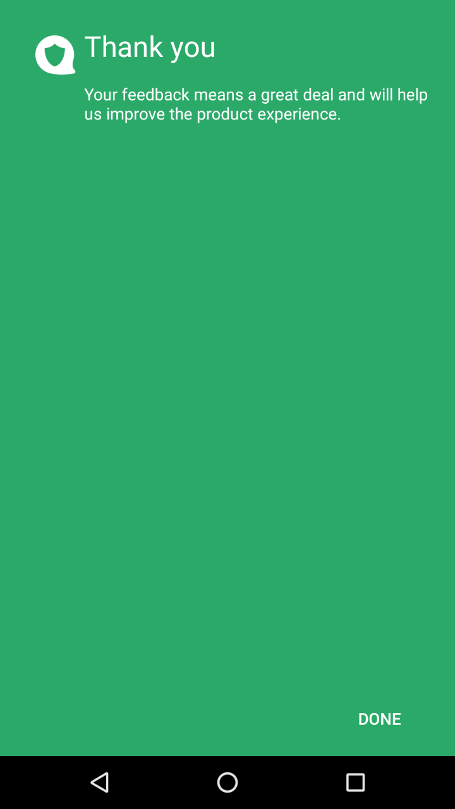

Customise Permission Layout
======================

# Introduction
For Android Marshmallow (API 23) and above, a rationale for each permission is being displayed, and one feature of our Data SDK is to state the use of the permissions on the application. You can see the sample screens below. 

Permission Introduction Screen:

 

Permission Rationale Screen:

 

Permission Feedback Screen:

 

Permission Feedback Thank You Screen:



## Customization a new permission layouts

As an added feature, you can customise the 4 layout for the permissions as shown above.

* **Introduction** - An informative screen to tell user that permissions are required for the application to generate credit score
* **Rationale** - A rationality screen that describe each permission on why and how it is need to generate credit score.
* **Feedback** - A feedback screen for user to answer why they don't want to grant the permission required by the application
* **Feedback Thank You** - A thank you screen for sending there feedback for not granting the access or use the permissions.


Below is a sample and proper way to customise permission screen. You can change on how you would display the rationale and etc. 

### Introduction
> Default - [permissionintro.xml](https://github.com/Lenddo/android-lenddo/blob/master/lenddosdk/src/main/res/layout/permissionintro.xml)
>
> Sample customised - [custom_permissionintro.xml](https://github.com/Lenddo/android-lenddo/blob/master/mobiledata_demo/src/main/res/layout/custom_permissionintro.xml)

#### Requirements
1. Retain the buttons with id:
	* btn_perm_intro_cancel - a button for cancelling permission screen and will be go to feedback.
	* btn_perm_intro_continue - a button for continuing to rationale screen to view a more detailed description of each permission.


### Rationale
> Default - [permissionrationale.xml](https://github.com/Lenddo/android-lenddo/blob/master/lenddosdk/src/main/res/layout/permissionrationale.xml)
>
> Sample customised - [custom_permissionrationale.xml](https://github.com/Lenddo/android-lenddo/blob/master/mobiledata_demo/src/main/res/layout/custom_permissionrationale.xml)

#### Requirements
1. Retain the buttons with id:
	* btn_perm_rationale_cancel - a button for cancelling permission screen and will be go to feedback.
	* btn_perm_rationale_continue - a button for continuing to application after successfully granting required permission.
2. Retain the text view with id:
	* tv_permission_rationale_maintext - a label introduction for the permission rationale. It has two state shown in the [string.xml](https://github.com/Lenddo/android-lenddo/blob/master/lenddosdk/src/main/res/values/strings.xml) (permission_rationale_partial and permission_rationale_complete)
3. Retain the layout views with id:
	* grp_permission_phone - a layout view that holds the rationale of phone permission
	* grp_permission_sms - a layout view that holds the rationale of sms permission
	* grp_permission_contacts - a layout view that holds the rationale of contacts permission
	* grp_permission_location - a layout view that holds the rationale of location permission
	* grp_permission_calendar - a layout view that holds the rationale of calendar permission
	* grp_permission_media - a layout view that holds the rationale of media permission

### Feedback
> Default - [permissionfeedback.xml](https://github.com/Lenddo/android-lenddo/blob/master/lenddosdk/src/main/res/layout/permissionfeedback.xml)
>
> Sample customised - [custom_permissionfeedback.xml](https://github.com/Lenddo/android-lenddo/blob/master/mobiledata_demo/src/main/res/layout/custom_permissionfeedback.xml)

#### Requirements
1. Retain the buttons with id:
	* btn_perm_feedback_back - a button for cancelling feedback permission screen and will be go back to introduction / rationale.
	* btn_perm_feedback_continue - a button for submitting feedback on not granting access for the permissions.
2. Retain the radio group and radio buttons with id:
	* rgrp_feedback - a radio group that contains the different posible reason for not granting the permission
	* rbtn_feedback1 - a radio button describe worries about data privacy 
	* rbtn_feedback2 - a radio button describe on how this permission will help
	* rbtn_feedback3 - a radio button describe worries on how the datas are being use
	* rbtn_feedback4 - a radio button for other reason and will enable input text view
3. Retain the edit text with id:
	* edt_otherfeedback - a edit text for user other reason for not granting the permission 

### Feedback Thank You
> Default - [permissionthankyou.xml](https://github.com/Lenddo/android-lenddo/blob/master/lenddosdk/src/main/res/layout/permissionthankyou.xml)
> Sample customised - [custom_permissionthankyou.xml](https://github.com/Lenddo/android-lenddo/blob/master/mobiledata_demo/src/main/res/layout/custom_permissionthankyou.xml)

#### Requirements
1. Retain the button with id:
	* btn_perm_ty_done - a button for acknowledgement and closing the permission screen.

## Using the custom permision layout
Rather than editing the default layout, make sure to create a new set of layout to and set it up using the ***ClientOption*** ***setCustomMPermissionLayout*** method

```java

package com.sample.app;

import android.app.Application;

import com.lenddo.mobile.core.LenddoCoreInfo;
import com.lenddo.mobile.datasdk.AndroidData;
import com.lenddo.mobile.datasdk.models.ClientOptions;

public class  SampleApp extends Application {
   @Override
   public void onCreate() {
       super.onCreate();
       LenddoCoreInfo.initCoreInfo(getApplicationContext());

       ClientOptions clientOptions = new ClientOptions();
       clientOptions.enableLogDisplay(BuildConfig.DEBUG);

       // Uncomment the next line when you want data to be uploaded only when wifi is available
       // clientOptions.setWifiOnly(true);

	   // Using a custom set of permission screen
	   clientOptions.setCustomMPermissionLayout(
		   R.layout.custom_permissionintro,
		   R.layout.custom_permissionrationale,
		   R.layout.custom_permissionfeedback,
		   R.layout.custom_permissionthankyou);

       AndroidData.setup(getApplicationContext(), clientOptions);
   }
}
```
