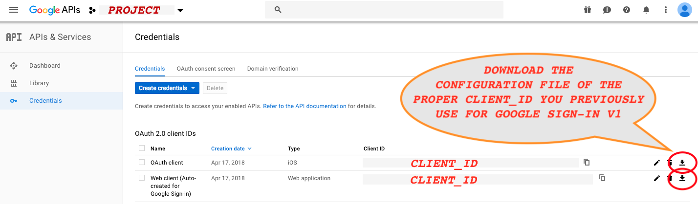
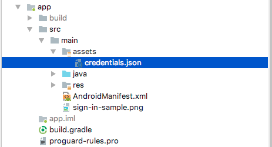

# Migrating from native Google SignIn v1 to Google SignIn v2

Google SignIn v1 has been deprecated, We have update the GoogleSignInHelper class to accommodate Google SignIn v2. With the changes on class, we need to update some configuration to enable Google SignIn v2 into email on-boarding.

## Update GoogleSignInHelper.java class file

Update your GoogleSignInHelper (v1.3.*) class by copying and overwriting your existing GoogleSignInHelper (v1.4.*).

## Update build.gradle files

1. In your app-level build.gradle file, declare Google Play services with Google REST > API as dependencies, in your application module build.gradle file:
```java
dependencies {
   compile fileTree(dir: 'libs', include: ['*.jar'])
   compile project(':lenddosdk')
   
   // Dependencies for the Google Play services
   compile 'com.google.android.gms:play-services-auth:11.8.0'

   // Dependencies for the Google REST API
   compile 'com.google.api-client:google-api-client:1.22.0'
   compile 'com.google.api-client:google-api-client-android:1.22.0'
   compile 'com.google.apis:google-api-services-people:v1-rev139-1.22.0'
}

apply plugin: 'com.google.gms.google-services'
 
```
2. In your project's top-level build.gradle file, ensure that Google's Maven repository is included:
```java
dependencies {
       classpath 'com.android.tools.build:gradle:2.3.1'
       classpath 'com.google.gms:google-services:3.0.0'
}

allprojects {
   repositories {
       maven {
          url 'https://maven.google.com'
       }
       mavenLocal()

       // If you're using a version of Gradle greater than or equal 4.1, you must instead use:
       // google()
   }
```

## Download credentials.json from Google API Console Project Dashboard

On previous version we use google-service.json file, but for GoogleSign v2 we need to get credentials.json from API Console Project. For starter, we need to have a Google Api project setup for Google native Sign-in, you have previously setup this upon using Google SignIn v1, to have credentials.json we need to do the following.
> 1. We need to go to [Google API Console](https://console.developers.google.com/apis/credentials?project=_) and select your project. On your project [Credentials](https://console.developers.google.com/apis/credentials)'s tab, download the configuration file fron list of OAuth 2.0 client IDs, select and download the OAuth 2.0 client with google_client_id you previously use on Google SignIn v1 (please refer to your string.xml with key google_client_id).



> 2. As you download the configuration file rename the file unto credentials.json and put file onto your src assets directory.


