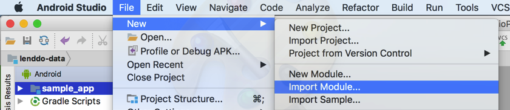
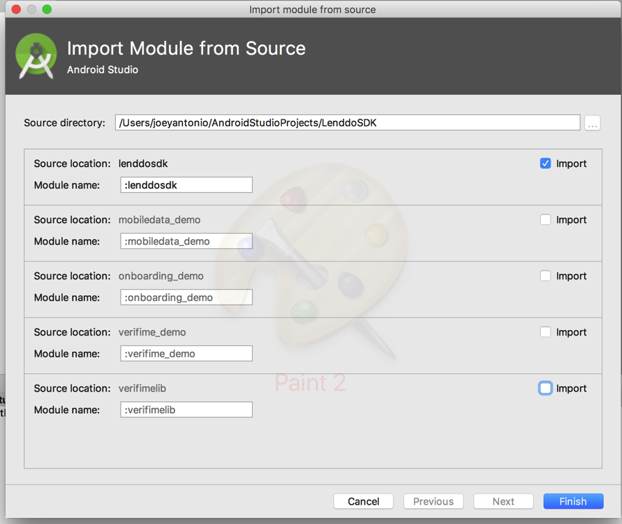

MIGRATION TO THE NEW LENDDO SDK
===

The new Lenddo SDK has now combined the Data collection module and Social Onboarding module in a single library. It had a lot of changes and improvements that migrating to this new SDK will require the developer to follow the steps below:

1. Remove the old modules that exists from your project, remove the module directory in your workspace
   - lenddodatasdk (Lenddo Data SDK)
   - LenddoSDK (Lenddo Onboarding SDK)
 
   In Project Structure select the above modules and click the - (Delete) button from the upper left of the window.
    
   This will remove the modules in your project settings, the developer will have to manually delete the module's directory in the workspace. It is required to remove the directories of the old modules.
 
   Remove the old dependencies in your app's build.gradle file
 
   ```xml
    compile project(':lenddodatasdk')
    compile project(':LenddoSDK')
   ```
 
2. Import the new Lenddo SDK as a module


   
 
   Import the selected modules:
      - lenddosdk

   
 
   Add the new dependency to your app's build.gradle
 
   ```java
   compile project(':lenddosdk')
   ```

3. Fix the imports in java file
   Change from the old package names to the new package names

   FROM:
   
    ```java
    import com.lenddo.core.analytics.FormFillingAnalytics;
    import com.lenddo.core.uiwidgets.TimedAutoCompleteTextView;
    import com.lenddo.core.uiwidgets.TimedEditText;
    import com.lenddo.data.AndroidData;
    import com.lenddo.data.listeners.OnDataSendingCompleteCallback;
    import com.lenddo.data.models.ApplicationPartnerData;
    import com.lenddo.data.utils.AndroidDataUtils;
    import com.lenddo.data.client.LenddoConstants;
    ```

    TO:
    
    ```java
    import com.lenddo.mobile.datasdk.core.analytics.FormFillingAnalytics;
    import com.lenddo.mobile.core.uiwidgets.TimedAutoCompleteTextView;
    import com.lenddo.mobile.core.uiwidgets.TimedEditText;
    import com.lenddo.mobile.datasdk.AndroidData;
    import com.lenddo.mobile.datasdk.listeners.OnDataSendingCompleteCallback;
    import com.lenddo.mobile.datasdk.models.ApplicationPartnerData;
    import com.lenddo.mobile.datasdk.utils.AndroidDataUtils;
    import com.lenddo.mobile.datasdk.client.LenddoConstants;
    ```

   Use the auto import feature of the Android Studio IDE to easily fix these incorrect imports. Code -> Optimize Imports


4. Fix the xml layout package names
   In you XML layouts that uses the Lenddo custom widgets, change the package names. This can be skipped if not used.

   FROM:
   
    ```java
    com.lenddo.core.uiwidgets.TimedEditText
    com.lenddo.core.uiwidgets.TimedAutoCompleteTextView
    com.lenddo.core.uiwidgets.TimedRadioButton
    com.lenddo.core.uiwidgets.TimedSeekbar
    ```

    TO:
    
    ```java
    com.lenddo.mobile.core.uiwidgets.TimedEditText
    com.lenddo.mobile.core.uiwidgets.TimedAutoCompleteTextView
    com.lenddo.mobile.core.uiwidgets.TimedRadioButton
    com.lenddo.mobile.core.uiwidgets.TimedSeekbar
    ```

