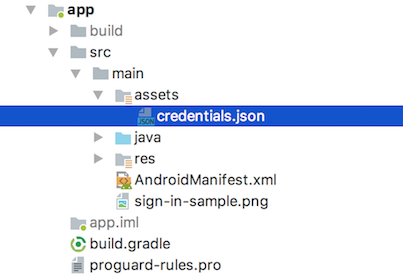
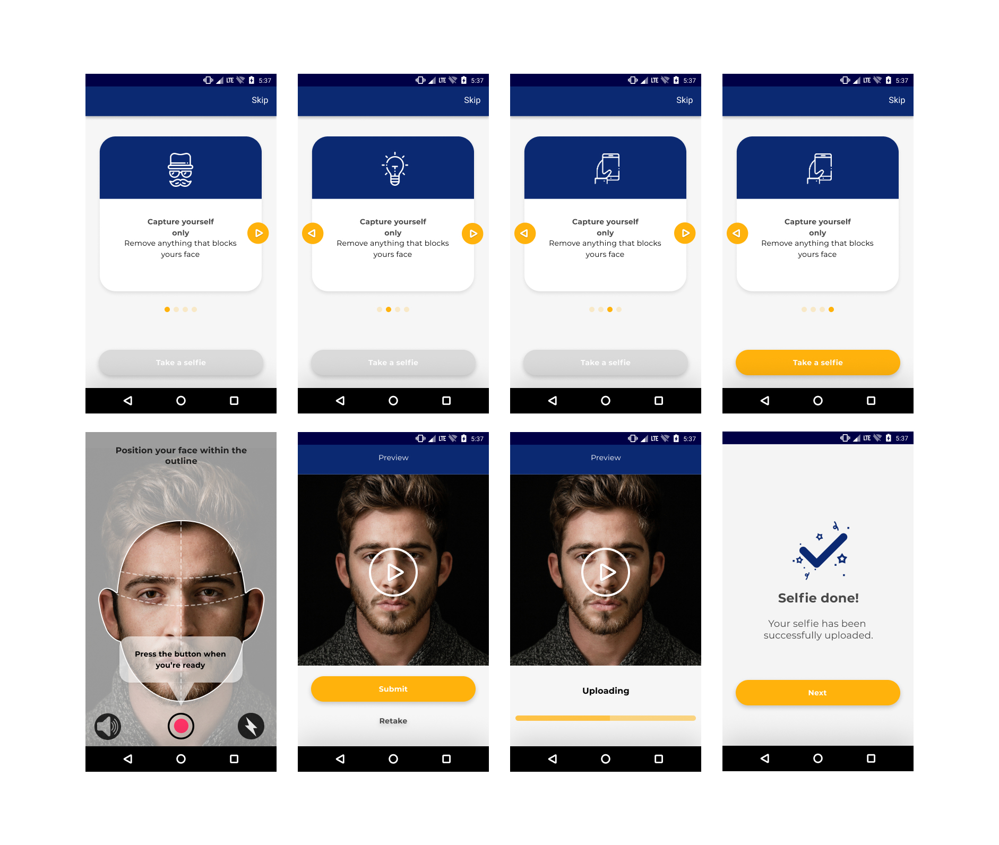
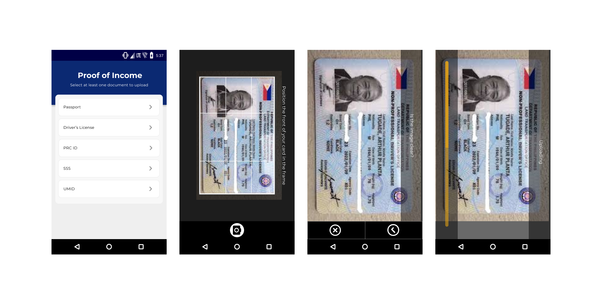
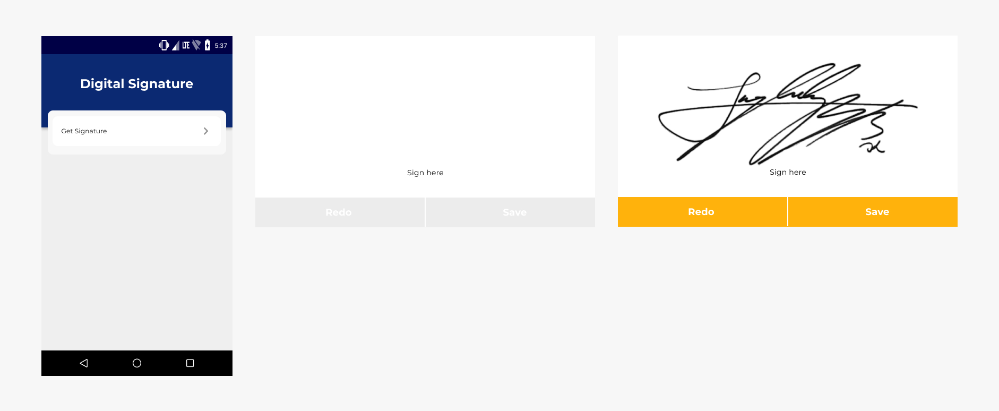

Lenddo Social Network Onboarding
======================

# 1. Table of Contents
<!-- TOC -->

- [1. Table of Contents](#1-table-of-contents)
- [2. Introduction](#2-introduction)
- [3. An Overview of the Lenddo Process](#3-an-overview-of-the-lenddo-process)
- [4. Getting Started](#4-getting-started)
    - [4.1. Requirements](#41-requirements)
    - [4.2. Installation update with screenshot](#42-installation-update-with-screenshot)
- [5. Setting up the Sample Loan App](#5-setting-up-the-sample-loan-app)
- [6. Adding the Lenddo library to your existing project](#6-adding-the-lenddo-library-to-your-existing-project)
    - [6.1. Edit your **settings.gradle** file and add the following:](#61-edit-your-settingsgradle-file-and-add-the-following)
    - [6.2. Edit the App build.gradle](#62-edit-the-app-buildgradle)
        - [6.2.1. Edit build.gradle](#621-edit-buildgradle)
            - [6.2.1.1. Example Gradle Dependencies _after modification_](#6211-example-gradle-dependencies-_after-modification_)
    - [6.3. Additional Steps Required if You Have E-mail Onboarding](#63-additional-steps-required-if-you-have-e-mail-onboarding)
        - [6.3.1. Update the build.gradle files](#631-update-the-buildgradle-files)
        - [6.3.2. Configuring a Google API console project](#632-configuring-a-google-api-console-project)
        - [6.3.3. Native Google Email Sign In Helper Class](#633-native-google-email-sign-in-helper-class)
        - [6.3.4. Enabling Gmail API and Contacts API](#634-enabling-gmail-api-and-contacts-api)
    - [6.4. Permissions](#64-permissions)
    - [6.5. Embed GoogleSignInHelper into Onboarding process](#65-embed-googlesigninhelper-into-onboarding-process)
    - [6.6. Migrating Google SignIn v1 (Lenddo SDK v1.3.*) to v2 (Lenddo SDK v1.4.*)](#66-migrating-google-signin-v1-lenddo-sdk-v13-to-v2-lenddo-sdk-v14)
- [7. Integration](#7-integration)
    - [7.1. Configuring the Partner Script Id dynamically](#71-configuring-the-partner-script-id-dynamically)
    - [7.2. Adding Probe data for Verification](#72-adding-probe-data-for-verification)
    - [7.3. Add the Lenddo Button to your form](#73-add-the-lenddo-button-to-your-form)
    - [7.4. Customizing the Lenddo Button](#74-customizing-the-lenddo-button)
    - [7.5. Customizing the Popup Dialog when pressing the back key](#75-customizing-the-popup-dialog-when-pressing-the-back-key)
    - [7.6. Using the Lenddo AutoComplete View](#76-using-the-lenddo-autocomplete-view)
    - [7.7. Setting API Region](#77-setting-api-region)
    - [7.8. Adding Native Facebook Integration](#78-adding-native-facebook-integration)
- [8. eKYC](#7-ekyc)
    - [8.1. Selfie and Liveness](#81-selfie-and-liveness)
    - [8.2. Document Capture](#81-document-capture)
    - [8.3. Signature Capture](#81-signature-capture)
- [9. Frequently Asked Questions](#8-frequently-asked-questions)
    - [9.1. *How do I use the Lenddo button without form data?*](#81-how-do-i-use-the-lenddo-button-without-form-data)
    - [9.2. *Why do we require the Google Web Client ID?*](#82-why-do-we-require-the-google-web-client-id)
    - [9.3. *Why do I get an INVALID_AUDIENCE error when using Native Google Integration?*](#83-why-do-i-get-an-invalid_audience-error-when-using-native-google-integration)

<!-- /TOC -->

# 2. Introduction

This is the Lenddo Onboarding SDK for Android based devices, if you are developing for other platforms like IOS and web, please refer to the [online documentation] (http://www.lenddo.com/documentation/lenddo_button.html)

The Lenddo SDK for Android allows you to integrate the Lenddo Verification and/or Scoring workflow seamlessly into your Android app.

# 3. An Overview of the Lenddo Process

1.  User fills up a form on your app.
2.  User clicks on the **Lenddo Button** provided by the Lenddo SDK.
3.  The Lenddo Authorize site is shown.
4.  User completes the Lenddo Authorize process.
5.  A callback to your app is initiated and your app will consume the results.
6.  User is sent to the next phase in your app.

# 4. Getting Started

1.  First make sure you have all the requirements. See the [Requirements](#user-content-requirements) section below.
2.  Successfully run the SDK in a simple loan app. See the [Installation update with screenshot](#user-content-installation-update-with-screenshot) section below.
3.  Add the Lenddo SDK libraries to your own application.
4.  Test and deploy

## 4.1. Requirements

Before you start on integrating the Lenddo SDK, please make sure you have the following

1.  Properly installed latest version of **Android Studio**. You may refer to the Google Developer Docs on how to set this up [https://developer.android.com/sdk/index.html](https://developer.android.com/sdk/index.html)
2.  A valid Lenddo **Partner Script Id**
3.  Basic knowledge on setting up Android Libraries. (This document will explain the specific steps for the Lenddo SDK only).
4.  Download the LenddoSDK onto your hard drive
5.  For email onboarding, a **credentials.json** file is required in the app src's assets directory and Google **Web** OAuth2.0 Client Id (this is for native google signin).

## 4.2. Installation update with screenshot

Download the Lenddo SDK and extract the archive into your local drive. After extracting the archive, the Lenddo SDK folder structure should look like this:


The **LenddoSDK** folder contains the actual Lenddo SDK library project that you can include in your app. The **simple_loan** folder contains the sample app called **Simple Loan** which illustrates how to integrate the **Lenddo Button** into your existing app.

# 5. Setting up the Sample Loan App

1.  Using Android Studio, click on **Select File -> Open** and **choose** the folder LenddoSDK-android which was created when you extracted the Lenddo SDK.zip. Android Studio will automatically set up the project for you.
2.  _(If you have an e-mail onboarding step)_ You need to configure a google api console project by clicking the button  "Configure a Project" [from this link](https://developers.google.com/identity/sign-in/android/start-integrating#configure_a_console_name_project). And provided that the package name should be: **lenddo.com.lenddoconnect** and you will also need to provide the SHA-1 hash of your signing certificate (**debug.keystore** is enough for this demo). After successfully creating a google api console project, you must download client configuration and it will be download as **credentials.json** and copy the **Client ID** from the last dialog window of configure a project wizard. Overwrite the **credentials.json** file on the Simple Loan demo src asset's directory (as shown in the picture below). 
3.  The sample app is already configured to use the LenddoSDK, all you need to do is to fill in your **partner-script-id**. Edit the **simple_loan/src/main/res/values/config.xml** and replace the words "PLACE YOUR PARTNER SCRIPT ID HERE" with the **partner_script_id** key provided to you. (See below).
    * _(Ff you have an e-mail onboarding step)_ Fill in the Google Web Client Id in the String as shown below. Get it from the [Google API Manager](https://console.developers.google.com/apis/credentials) site under the Credentials link.

```xml
        <?xml version="1.0" encoding="utf-8"?>
        <resources>
          <!-- Lenddo Partner Script ID -->
          <string name="lenddo_app_id">PLACE_YOUR_PARTNER_SCRIPT_ID_HERE</string>
          <!-- Google Client ID from credentials.json-->
          <string name="google_client_id">PLACE_YOUR_GOOGLE_API_CONSOLE_PROJECT_CLIENT_ID_HERE</string>
        </resources>
```

5.  Now, build and run the sample app (_make sure you have your emulator running or you have an Android device connected and configured for development. If you need more information on how to do this, please refer to the Android Studio documentation to learn more_).
6.  When the sample app successfully launches, you will see a sample form with a Lenddo Button at the bottom and an application ID field above it. This application ID field corresponds to an id that is created by your app (for testing purposes you can enter a sample ID).
7.  Click on the **Submit and Get Verified** button to complete the authorize process.

If you would like more information on how this works you can view The file **SampleActivity.java** in the simple_loan/src/main/java/lenddo.com.lenddoconnect folder

# 6. Adding the Lenddo library to your existing project

Inside the extracted directory, import **lenddosdk** as module into your android project.

## 6.1. Edit your **settings.gradle** file and add the following:
```java
include ':lenddosdk'
```

## 6.2. Edit the App build.gradle
### 6.2.1. Edit build.gradle
Open and edit the app-level **build.gradle** file (not the project's top-level). You should see a section for dependencies and add `implementation project(':lenddosdk')`

#### 6.2.1.1. Example Gradle Dependencies _after modification_
```java
dependencies {
    implementation fileTree(dir: 'libs', include: ['*.jar'])

    implementation project(':lenddosdk')
}
```

---

## 6.3. Additional Steps Required if You Have E-mail Onboarding
If you have the e-mail onboarding step included with your Authorize onboarding experience, you need add some resources required for native google signin. Follow the steps below. _This part is only for applications that have an Email Onboarding process. Ignore these otherwise._

### 6.3.1. Update the build.gradle files
> 
> #### 1. In your app-level **build.gradle** file, declare Google Play services with Google REST API as dependencies, in your application module **build.gradle** file:
>```java
> dependencies {
>    implementation fileTree(dir: 'libs', include: ['*.jar'])
>    implementation project(':lenddosdk')
>
>    // Dependencies for the Google Play services
>    implementation 'com.google.android.gms:play-services-auth:16.0.1'
>
>    // Dependencies for the Google REST API
>    implementation 'com.google.api-client:google-api-client:1.22.0'
>    implementation 'com.google.api-client:google-api-client-android:1.22.0'
>    implementation 'com.google.apis:google-api-services-people:v1-rev139-1.22.0'
> }
>
> apply plugin: 'com.google.gms.google-services'
>```
>
> #### 2. In your project's top-level build.gradle file, ensure that Google's Maven repository is included:
>```java
> dependencies {
>        classpath 'com.android.tools.build:gradle:3.3.0'
>        classpath 'com.google.gms:google-services:4.2.0'
> }
>
> allprojects {
>    repositories {
>        maven {
>           url 'https://maven.google.com'
>        }
>        mavenLocal()
>
>        // If you're using a version of Gradle greater than or equal 4.1, you must instead use:
>        // google()
>    }
>```
----

Android Studio should tell you to resync, the SDK classes should now be available after that.

### 6.3.2. Configuring a Google API console project

You need to configure a google api console project by click the button  "Configure a Project" [from this link](https://developers.google.com/identity/sign-in/android/start-integrating#configure_a_console_name_project). You need to provide the package name of your android application, you can check your **AndroidManifest.xml** file to verify the package name and you also need to provide the SHA-1 hash of your signing certificate. After successfully creating a google api console project, you must download client configuration and it will be download as **credentials.json** and copy the **Client ID** from the last configure a project dialog window. Put the **credentials.json** file onto your src **assets** directory and place your client id into your **AndroidManifest.xml** as meta data inside the application key, as shown below.

AndroidManifest.xml

```xml
<application
   ...
   >
...
<!-- Google Client Id for Google Signin  -->
<meta-data android:name="googleClientId" android:value="@string/google_client_id" />

</application>
```

strings.xml

```xml
<?xml version="1.0" encoding="utf-8"?>
    <string name="google_client_id">PLACE_YOUR_GOOGLE_API_CLIENT_ID_HERE</string>
</resources>
```

### 6.3.3. Native Google Email Sign In Helper Class
A native Google Email signin helper class is provided. Simply create a new package in your application: **com.lenddo.nativeonboarding** and copy the signin helper class. [GoogleSignInHelper](https://github.com/Lenddo/android-lenddo/blob/master/onboarding_demo/src/main/java/com/lenddo/nativeonboarding/GoogleSignInHelper.java)

### 6.3.4. Enabling Gmail API and Contacts API
In order for the application to have login access and use Gmail onboarding for scoring, the Gmail API must be enabled in the [Google API Console](https://console.developers.google.com/apis/library). 

 - Choose your correct project
 - Under Library, search for Gmail and click Enable
 - Enabling Contacts API will also help improve score generation so enable that as well.

## 6.4. Permissions
In addition to the required permissions defined from within the SDK, _which are automatically incorporated into your app_, you must ensure the following permissions are also required:

```xml
<uses-permission android:name="android.permission.INTERNET" />
<uses-permission android:name="android.permission.ACCESS_NETWORK_STATE" />
<uses-permission android:name="android.permission.CAMERA" />
```

Camera permission is required for eKYC feature.

## 6.5. Embed GoogleSignInHelper into Onboarding process
To use GoogleSignInHelper, we will use UIHelper addGoogleSignIn method
*addGoogleSignIn(new GoogleSignInHelper())* method after UIHelper object instantiation as shown below.

*Sample code:*

```java
// UIHelper object instantiation
helper = new UIHelper(this, this);

// Add support for Native Google SignIn
helper.addGoogleSignIn(new GoogleSignInHelper());
```

## 6.6. Migrating Google SignIn v1 (Lenddo SDK v1.3.*) to v2 (Lenddo SDK v1.4.*)
Please refer to this [link](migrating-google-sign-in-v1-to-v2.md).

# 7. Integration

## 7.1. Configuring the Partner Script Id dynamically

Normally, an application will only need a partner script id. The Onboarding SDK allows changing of partner script id dynamically by setting it using the FormDataCollector object. Simply call the setPartnerScriptId() method before calling the UIHelper.showAuthorize() method or before clicking the Lenddo button or use LenddoCoreInfo setOnboardingPartnerScriptId() method on Application class.

```java
package com.sample.app;

import android.support.multidex.MultiDexApplication;

import com.lenddo.mobile.core.LenddoCoreInfo;
import com.lenddo.mobile.datasdk.AndroidData;
import com.lenddo.mobile.datasdk.models.ClientOptions;

public class  SampleApp extends MultiDexApplication {
   @Override
   public void onCreate() {
       super.onCreate();
       LenddoCoreInfo.initCoreInfo(getApplicationContext());

       String onboardingPartnerScriptId = "YOUR NEW PARTNER SCRIPT ID";
       LenddoCoreInfo.setOnboardingPartnerScriptId(getApplicationContext(), onboardingPartnerScriptId);
   }
}
```

```java
    String onboardingPartnerScriptId = "YOUR NEW PARTNER SCRIPT ID";
    
    // Configure the partner script dynamically if needed
    FormDataCollector formData = new FormDataCollector()
    formData.setPartnerScriptId(onboardingPartnerScriptId);
```

## 7.2. Adding Probe data for Verification
    
Probe data or user information are gathered from the application to be used for verification purposes. Probe may come from an application form that the user will need to fill up. Once the user fill's up the application form fields, the data is then passed to the Onboarding SDK as probe data. See code below on how to pass the probe data.

```java
// Get the user information from your application form's EditText widgets and pass them here
private FormDataCollector getProbeData(FormDataCollector formData) {
    // Place partner defined application id if not yet defined
    formData.setApplicationId("YOUR_APPLICATION_ID_STRING_HERE");
    formData.setLastName("LASTNAME STRING");
    formData.setFirstName("FIRSTNAME STRING");
    formData.setEmail("EMAIL STRING");
    formData.setDateOfBirth("01/01/2000"); // FORMAT: dd/MM/yyyy
    // Add additional fields such as EmployerName, MobilePhone, University, Address, etc
    
    // Configure the partner script dynamically if needed
    String partnerscript_id = "YOUR NEW PARTNER SCRIPT ID";
    formData.setPartnerScriptId(partnerscript_id);
    
    // Adding Government IDs
    governmentIds.add(new GovernmentId("DEMO-TYPE", "DEMO-VALUE"));
    governmentIds.add(new GovernmentId("passport", "PAS_018218ASVR"));
    governmentIds.add(new GovernmentId("sss", "SSS_0-390128411-1274"));
    governmentIds.add(new GovernmentId("tin", "TIN_3023749103"));
    formData.setGovernmentIds(governmentIds);

    // send custom fields
    formData.putField("Loan_Amount", "25000");

    formData.validate();
    return formData;
}
```

## 7.3. Add the Lenddo Button to your form

The Lenddo button greatly simplifies integrating the Lenddo workflow to your app.

1.  Create your form (if you don't have an existing one already)

    The Lenddo verification process requires at the minimum, the following fields:

    *   Primary Address
    *   Email
    *   Last Name
    *   Middle Name
    *   First Name
    *   Date of Birth
    *   Home Phone Number
    *   Mobile Phone Number
    *   University
    *   Employer

    However the exact fields that is required for your App may be different depending on your requirements or use cases, please talk to your LenddoEFL Representative regarding this.

2.  Open up your Forms' layout xml and add the following to include the Lenddo Button onto your Layout:

    ```java
    <com.lenddo.sdk.widget.LenddoButton
       android:id="@+id/verifyButton"
       android:layout_width="match_parent"
       android:layout_height="wrap_content"
       android:layout_gravity="center_horizontal"
       android:gravity="center" />
    ```

    Note that you can also use your own custom button. (See section on customization for more information)

3.  Create an Instance of the UIHelper class inside the onCreate block of your activity. Note that the class constructor requires a **LenddoEventListener**. For the sample app, it implements the current activity as a **LenddoEventListener**.

    ```java
    private UIHelper helper;

    protected void onCreate(Bundle savedInstanceState) {
        ....
        helper = new UIHelper(this, this);
        helper.addGoogleSignIn(new GoogleSignInHelper());  // Add this line only if your application has an email onboarding process.
    }
    ```

4.  Setup your activity to implement the **LenddoEventListener** in your class or you can define your own class:

    ```java
    public class SampleActivity extends Activity implements LenddoEventListener {

        ....

        private UIHelper helper;

        protected void onCreate(Bundle savedInstanceState) {
            ....
            helper = new UIHelper(this, this);
            helper.addGoogleSignIn(new GoogleSignInHelper());  // Add this line only if your application has an email onboarding process.
            String applicationId = "your application id";
            LenddoCoreInfo.setCoreInfo(getApplicationContext(), LenddoCoreInfo.COREINFO_APPLICATION_ID, applicationId);
        }

        @Override
        public boolean onButtonClicked(FormDataCollector collector) {
            return true;
        }

        @Override
        public void onAuthorizeComplete(FormDataCollector collector) {
        }

        @Override
        public void onAuthorizeCanceled(FormDataCollector collector) {
        }

        @Override
        public void onBackPressed() {
            if (helper.onBackPressed()) {
                super.onBackPressed();
            }
        }
        
        ....
    }
    ```

    Note: These methods allow you to hook into the Lenddo Authorize process.

5.  Still on the onCreate method, Link the button to the UIHelper:

    ```java
    LenddoButton button = (LenddoButton) findViewById(R.id.verifyButton);
      button.setUiHelper(helper);
    ```

6.  Pass the content of the form using the form collector. On the onButtonClicked method, you can set the required information using the formData object passed to you. You can also send additional custom fields (To be discussed with your Lenddo representative)

    ```java
    @Override
    public boolean onButtonClicked(FormDataCollector formData) {
        formData = getProbeData(formData);

        // Place partner defined application id (if not yet defined)
        formData.setApplicationId("YOUR_APPLICATION_ID_STRING_HERE");
    
        // Configure the partner script dynamically (if needed only)
        formData.setPartnerScriptId("YOUR NEW PARTNER SCRIPT ID");

        return true;
    }
    ```

    **Important Note:** It is important here that you must pass a unique identifier to formData.setApplicationId, this will be used if you want to match your transaction records later on.

7.  Clicking on the Lenddo Button should trigger the Lenddo Authorization/Verification process and your app will be notified via onAuthorizeComplete when the process is done.
8.  Depending on your requirements a score may be available, in this case this is available through our REST APIs. (_Please check here for details http://www.lenddo.com/documentation/rest_api.html_)

## 7.4. Customizing the Lenddo Button

You may customize the Look and Feel of the Lenddo Button in a couple of ways:

1.  Style are available at the Lenddo SDK res/drawables where you can change various button attributes.
2.  You may create or use any of your existing Button. However you need to manually handle the onClick event with **UIHelper.showAuthorize** like this:

    ```java
    helper = new UIHelper(this, this);
    helper.addGoogleSignIn(new GoogleSignInHelper());  // Add this line only if your application has an email onboarding process.
    
    Button sampleButton = (Button) findViewById(R.id.sample_button);

    sampleButton.setOnClickListener(new View.OnClickListener() {
       @Override
       public void onClick(View v) {
           helper.showAuthorize();
       }
    });
    ```

## 7.5. Customizing the Popup Dialog when pressing the back key

Pressing the back key during the onboarding process will return the user to the previous screen. While on the initial screen, pressing the back key will display a popup dialog that will confirm if the user wants to cancel the onboarding process.

To customize the popup dialog's strings, simply add the following method after initializing the **helper** object:

```java
    helper = new UIHelper(this, this);
    helper.addGoogleSignIn(new GoogleSignInHelper());  // Add this line only if your application has an email onboarding process.
    helper.customizeBackPopup("Custom Back Title", "Custom Back Popup Message", "CUSTOM YES", "CUSTOM NO");
```

Also, overwrite the onBackPressed method of the calling Activity:

```java
    @Override
    public void onBackPressed() {
        if (helper.onBackPressed()) {
            super.onBackPressed();
        }
    }
```

## 7.6. Using the Lenddo AutoComplete View

To use Lenddo's AutoComplete view. Refer to this [link](autocomplete.md)

## 7.7. Setting API Region

To configure the Lenddo Onboarding SDK to use a specific API region. Refer to this [link](apiregion.md)

## 7.8. Adding Native Facebook Integration

To configure the Lenddo Onboarding SDK to add native Facebook Integration. Refer to this [link](nativefacebookintegration.md)

# 8. eKYC

Dependending on the workflow configuration, the SDK will be able to perform eKYC features such as Selfie and Liveness, Document Capture, and Signature capture. A camera and record audio permission will be requested by the SDK and must be provided by the user. Contact your LenddoEFL representative to have the document capture feature configured for your partner_script_id.

## 8.1. Selfie and Liveness

The SDK will use the device camera to record a selfie snapshot and a video recording. It will require audio capture as well to record sound from the device's microphone. A series of simple instructions that the user needs to follow within a timeframe are provided.

 

## 8.2. Document Capture

Based on the configuration, a set of required documents will be presented to the user and must be captured via the camera. Ensure that the image is clear and readable before submission.



## 8.3. Signature Capture

The screen is used for capturing signature using touch pen or finger touch. The user is allowed to clear and retry the signature capture before submission to get the best possible signature stroke.



# 9. Frequently Asked Questions

## 9.1. *How do I use the Lenddo button without form data?*

The application form data used as probe information are passed in the FormDataCollector object inside the onButtonClicked method. It is possible to not pass any other information aside from the application ID. See snippet below.

```java
@Override
public boolean onButtonClicked(FormDataCollector formData) {
    // Place partner defined application id if not yet defined
    formData.setApplicationId("123456789");
    return true;
}
```

## 9.2. *Why do we require the Google Web Client ID?*

While the google-services.json already contains the Google Android and Web OAuth2.0 Client IDs, it is still important to include the Google Web Client ID as a meta-data in the AndroidManifest.xml file. This data is then passed to the GoogleSignInHelper.java class and is part of the OAuth2.0 Native login process. The Web Client ID will be used by Lenddo's backend server to communicate callbacks for the login results. More information from [Google documentations](https://developers.google.com/identity/sign-in/android/start-integrating)

## 9.3. *Why do I get an INVALID_AUDIENCE error when using Native Google Integration?*

The INVALID_AUDIENCE error is caused by using the incorrect SHA1 signing certificate in the google-services.json file. Get your correct signing certificate hash for both debug and release using the gradle task "signingReport" and view the result in the Gradle console. Update your SHA1 certificate in the Firebase Console and download the latest google-services.json file.
